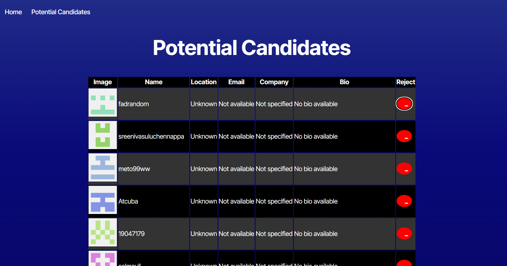

# Candidate Search


## Description 
Candidate Search is a React application that allows users to search for GitHub users and save potential candidates for future reference. This project is built using React, TypeScript, and Vite.

## Features

- Search for GitHub users
- View detailed information about each user
- Save potential candidates to local storage
- Remove saved candidates

## Project Structure

```
.eslintrc.cjs
.gitignore
environment/
    .env
index.html
LICENSE
package.json
public/
README.md
src/
    api/
        API.tsx
    App.tsx
    assets/
    components/
        Nav.tsx
    index.css
    interfaces/
        Candidate.interface.tsx
    main.tsx
    pages/
        CandidateSearch.tsx
        ErrorPage.tsx
        SavedCandidates.tsx
    vite-env.d.ts
tsconfig.json
tsconfig.node.json
vite.config.ts
```

## Installation

1. Clone the repository:
   ```sh
   git clone https://github.com/your-username/candidate-search.git
   cd candidate-search
   ```

2. Install dependencies:
   ```sh
   npm install
   ```

3. Create a `.env` file in the `environment` directory with your GitHub token:
   ```
   VITE_GITHUB_TOKEN=your_github_token
   ```


## License

This project is licensed under the MIT License. See the [LICENSE](LICENSE) file for details.
<br><br>

## Screenshots

<br><br>


## Deployed Link

You can view the deployed application [here](https://celadon-speculoos-b36e28.netlify.app/).

---


